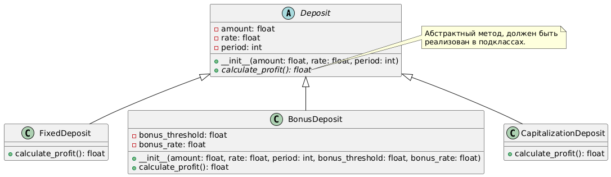

**Выполнил:** Астраков Борис, ПИЖ-б-о-23-1(1)

------------------------------------------------

# Задача 3. Банковские вклады

## Описание

Проект реализует классы `FixedDeposit`, `BonusDeposit` и `CapitalizationDeposit`, а также абстрактный класс `Deposit`. Код позволяет пользователю подобрать вклад по соответствующим параметрам.

#### Подробное содержание класса отражено в UML-диаграмме _(task_3/task_3_UML.png)_.


### Примеры использования

1. **Создание объектов:**

```python
r1 = Roman("X")  # Римское число 10
r2 = Roman(5)    # Арабское число 5
```

2. **Арифметические операции:**

```python
result_add = r1 + r2  # XV (15)
result_sub = r1 - r2  # V (5)
result_mul = r1 * r2  # LX (60)
result_div = r1 / r2  # II (2)
```
-------------------------------------------------------------------------
# Задача 2. Пиццерия

## Описание

Проект представляет собой простую реализацию классов `Пицца`, `Заказ` и `Терминал`, которые моделируют процессы изготовления пиццы и обработки заказов в пиццерии. Программа позволяет пользователю выбирать пиццы из меню, добавлять их в заказ и подтверждать оплату. Класс `Пицца` предоставляет методы для подготовки, выпекания, нарезки и упаковки пиццы, а также для отображения информации о ней. Кроме того, класс `Пицца` является базовым для создания разных вариаций пиццы (Пепперони, Барбекю, Дары моря).

#### Подробное содержание классов отражено в UML-диаграмме _(task_2/task_2_UML.png)_.

### Пример использования

При запуске программы пользователю будет предложено выбрать пиццы из меню:

```
Меню:
1. Пепперони (Тонкое, Томатный, Начинка: Пепперони, Сыр) - 500 руб.
2. Барбекю (Толстое, Барбекю, Начинка: Курица, Сыр, Лук) - 600 руб.
3. Дары моря (Тонкое, Сливочный, Начинка: Креветки, Кальмары, Сыр) - 700 руб.
Введите номер пиццы для добавления в заказ (или 0 для подтверждения):
```

После выбора пиццы программа выполнит необходимые действия и покажет итоговую сумму заказа.
