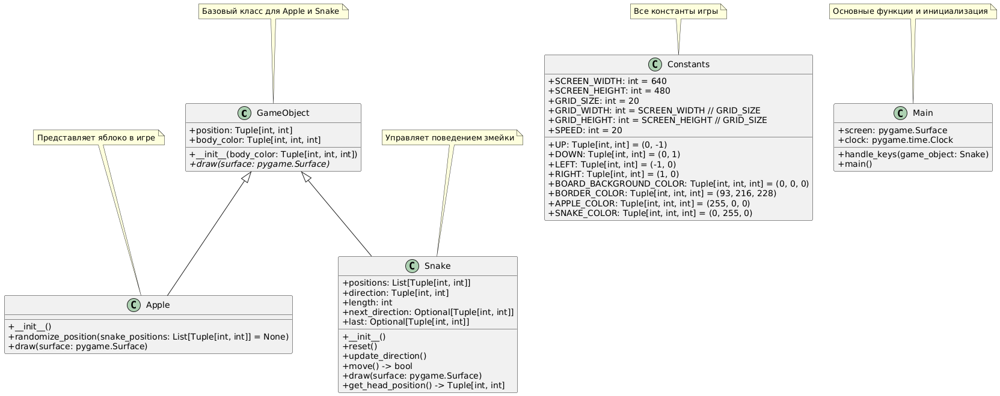

# Основы ООП на Python. Проект "Змейка"

Полнофункциональная реализация классической игры "Змейка" с использованием принципов ООП и библиотеки Pygame.

## Детализированный функционал

### Основные игровые механизмы:
- **Движение змейки** с постоянной скоростью
- **Система роста** - змейка удлиняется при поедании яблок
- **Система очков** (+1 за каждое съеденное яблоко)
- **Случайная генерация новых яблок** с исключением позиций змейки
- **Обнаружение столкновений** с самой собой (сброс игры)
- **Прохождение змейки** через границы экрана

### Технические особенности
- **Архитектура классов**:
  ```python
  GameObject (базовый класс)
  ├── Apple (яблоко)
  └── Snake (змейка)
  ```


  
- **Типизация** (использование typing для аннотаций)
- **Логика обновления направления** с защитой от разворота на 180°
- **Оптимизированная отрисовка**:
  - Перерисовка только измененных участков
  - Затирание хвоста при движении

### Игровой цикл:
1. Обработка ввода (клавиатура)
2. Обновление направления змейки
3. Перемещение змейки
4. Проверка столкновений
5. Проверка поедания яблок
6. Отрисовка кадра

## Библиотеки

- **flake8** 5.0.4
- **flake8-docstrings** 1.7.0
- **pep8-naming** 0.13.3
- **pycodestyle** 2.9.1
- **pygame** 2.5.2
- **pytest** 7.1.3
- **pytest-timeout** 2.1.0

## Тестирование

Для проверки структуры и функционала программы запустите скрипты из пути snake_project/tests.
