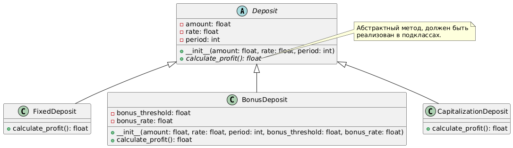
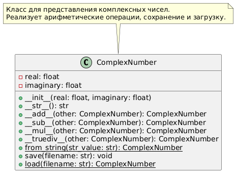

**Выполнил:** Астраков Борис, ПИЖ-б-о-23-1(1)

------------------------------------------------

# Задача 3. Банковские вклады

## Описание

Проект реализует классы `FixedDeposit`, `BonusDeposit` и `CapitalizationDeposit`, а также абстрактный класс `Deposit`. Код позволяет пользователю подобрать вклад по соответствующим параметрам.

#### Подробное содержание классов отражено в UML-диаграмме.


### Пример использования

```python
# Задание параметров депозита:
deposit = choose_deposit('bonus', amount=100000, rate=0.05, period=3, bonus_threshold=50000, bonus_rate=0.1)
# Расчёт прибыли по депозиту:
print(f"Прибыль по вкладу: {deposit.calculate_profit():.2f} руб.")
```

-------------------------------------------------------------------------
# Задача 4. Комплексное число

Этот проект реализует класс `ComplexNumber` для работы с комплексными числами на Python. Класс поддерживает основные арифметические операции, создание объектов из строк, а также сохранение и загрузку объектов в/из JSON-файла.

#### Подробное содержание класса отражено в UML-диаграмме.


### Пример использования

```python
from complex_number import ComplexNumber

# Создание объектов
cn1 = ComplexNumber(3, 4)
cn2 = ComplexNumber(1, 2)

# Арифметические операции
print(cn1 + cn2)  # Сложение
print(cn1 - cn2)  # Вычитание
print(cn1 * cn2)  # Умножение
print(cn1 / cn2)  # Деление

# Создание из строки
cn3 = ComplexNumber.from_string("5 + 6i")
print(cn3)

# Сохранение и загрузка
cn1.save("complex_number.json")
cn4 = ComplexNumber.load("complex_number.json")
print(cn4)
```
