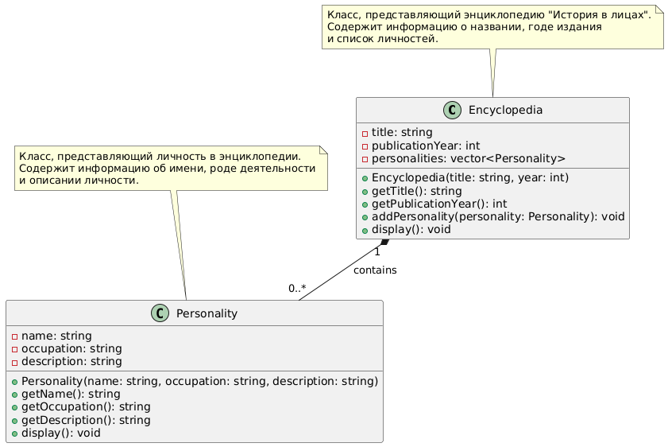
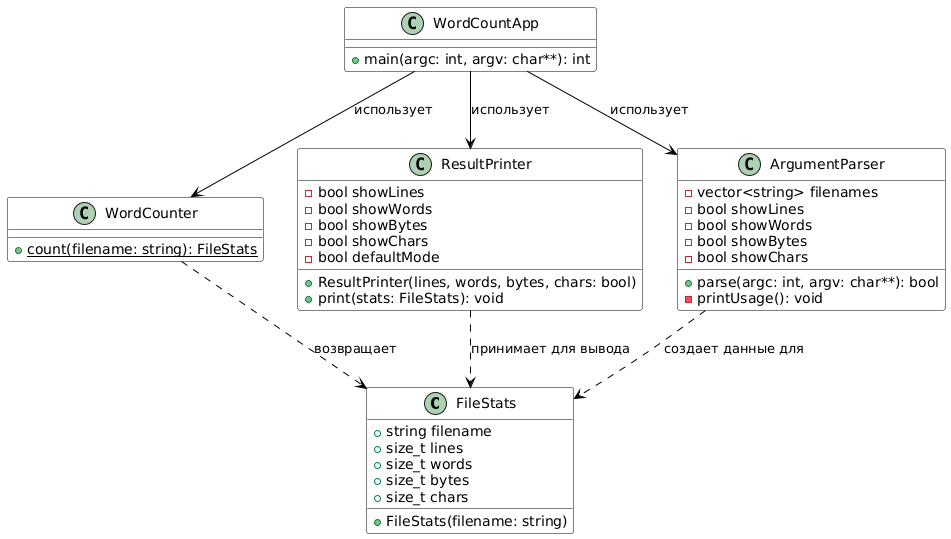

# Энциклопедия «История в лицах»

## Описание программы
Программа реализует электронную энциклопедию исторических личностей на C++. Включает два основных класса: `Encyclopedia` (хранит общую информацию) и `Personality` (описывает конкретную личность).

## UML-диаграмма


## Основные методы
**Класс Encyclopedia:**
- `addPersonality()` - добавление личности в энциклопедию
- `display()` - вывод всей информации

**Класс Personality:**
- `getName()`, `getOccupation()`, `getDescription()` - получение данных
- `display()` - вывод информации о личности

## Пример использования
```cpp
Encyclopedia history("История в лицах", 2023);

Personality einstein("Альберт Эйнштейн", "Физик", 
                   "Создатель теории относительности");
history.addPersonality(einstein);

history.display();
```

Вывод:
```
Энциклопедия: История в лицах
Год издания: 2023

Содержит следующие личности:
---------------------------
Имя: Альберт Эйнштейн
Род деятельности: Физик
Описание: Создатель теории относительности
```
-------------------------------------------------
# Утилита WordCount

## Описание программы
Утилита WordCount подсчитывает количество строк, слов, байт и символов в указанных файлах. Поддерживает различные опции для вывода конкретных статистических данных.

## Основные методы
- `WordCounter::count(filename)` - анализирует файл и возвращает структуру с статистикой
- `ArgumentParser::parse(argc, argv)` - обрабатывает аргументы командной строки
- `ResultPrinter::print(stats)` - форматирует вывод результатов согласно заданным опциям

## UML-диаграмма


## Пример использования
```bash
# Базовое использование (вывод строк, слов, байт)
WordCount.exe file.txt

# Комбинированные опции
WordCount.exe -lw file1.txt file2.txt

# Длинные опции и несколько файлов
WordCount.exe --lines --words --bytes *.txt

# Вывод только количества символов
WordCount.exe -m example.txt
```
