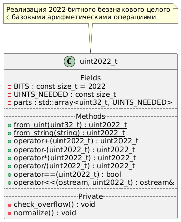
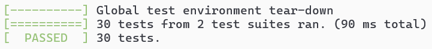

# Лабораторная работа 2. uint2022_t - 2022-битное беззнаковое целое число

### Реализация 2022-битного беззнакового целочисленного типа с набором арифметических операций.

**Этот проект:**
- Использует массив из 64 элементов uint32_t (256 байт + небольшие накладные расходы)
- Поддерживает все требуемые операции
- Корректно обрабатывает переполнения
- Имеет компактный размер (менее 300 байт)

**Особенности реализации:**
- Деление реализовано методом "длинного деления"
- Умножение - стандартным методом "в столбик"
- Вывод в поток выполняется через деление на 10 и сбор цифр в обратном порядке
- Конвертация из строки выполняется поцифрово с умножением на 10 и добавлением цифры

**Структура основного класса:**



## Требования

- Компилятор C++17 (GCC, Clang, MSVC)
- CMake ≥ 3.12
- Git (для загрузки зависимостей)
- Google Test (автоматически загружается через CMake)

## Сборка в VSC 2022

1. Откройте папку проекта в VS как CMake проект
2. Дождитесь завершения конфигурации
3. Соберите проект (Ctrl+Shift+B)

## Примеры использования

```cpp
uint2022_t a = from_uint(42);
uint2022_t b = from_string("12345678901234567890");
uint2022_t c = a + b;
std::cout << c << std::endl;
```

Поддерживаемые операции:
- Арифметические: `+`, `-`, `*`, `/`
- Сравнение: `==`, `!=`, `<`, `<=`
- Ввод/вывод: оператор `<<`

## Тестирование

Тесты используют Google Test framework.

### Запуск тестов в VSC 2022:
1. Откройте "Обозреватель тестов"
2. Нажмите "Запустить все"
Альтернатива: Тест / Запустить CTests

Тесты проверяют:
- Конвертацию из uint32_t и строк
- Арифметические операции
- Пограничные случаи
- Обработку ошибок

### Результаты тестов:



## Структура проекта

```
.
├── bin/                # Исполняемые файлы
│   └── main.cpp        # Пример использования
├── lib/                # Реализация библиотеки
│   ├── number.h        # Заголовочный файл
│   └── number.cpp      # Реализация
├── tests/              # Тесты
│   ├── CMakeLists.txt  # Конфигурация тестов
│   └── number_test.cpp # Юнит-тесты
└── CMakeLists.txt      # Основной CMake файл
```
