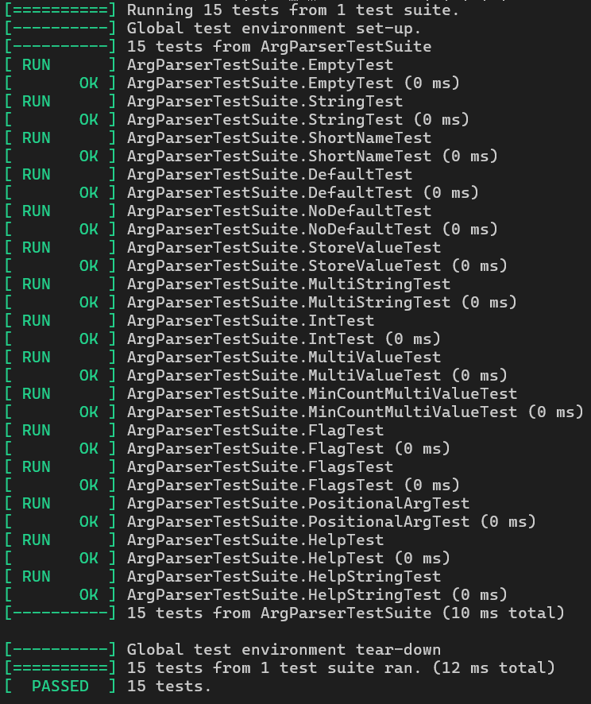

# Лабораторная работа 5. Парсер аргументов командной строки
------------------------
Библиотека для простого и удобного парсинга аргументов командной строки в C++ проектах.

## Особенности реализации
- Стандарт языка: C++17 с использованием возможностей STL
- Поддержка различных типов аргументов: строковые, целочисленные, булевы флаги
- Гибкая система валидации и обработки ошибок
- Максимальная длина имен аргументов ограничена 256 символами

## Основные функции и классы

**Класс ArgParser:**
- Конструктор с указанием имени программы
- Методы AddStringArgument, AddIntArgument и AddFlag для регистрации аргументов
- Методы StoreValue/StoreValues для привязки переменных

**Функциональность парсера:**
- Обработка коротких ```(-h)``` и длинных ```(--help)``` форматов аргументов
- Поддержка позиционных аргументов
- Возможность указания значений по умолчанию
- Валидация минимального количества значений для multi-value аргументов
- Автоматическая генерация справки ```(help)```

**Реализация хранения данных:**
- Внутреннее представление аргументов в структуре Argument
- Хранение значений в ```std::vector/std::optional```

**Логика работы:**
- Два варианта парсинга: из argc/argv и вектора строк
- Раздельная обработка именованных и позиционных аргументов
- Проверка обязательных аргументов
- Поддержка комбинированных флагов ```(-abc)```

**Обработка ошибок:**
- Проверка существования аргументов
- Валидация типов значений
- Обработка исключительных ситуаций

## Форматы данных
- Строковые аргументы: произвольный текст
- Целочисленные аргументы: 32-битные знаковые числа
- Булевы флаги: присутствие = true, отсутствие = false

## Ограничения
- Максимальное количество аргументов: 65535
- Максимальное количество значений для multi-value аргумента: 65535
- Поддержка только ASCII-имен аргументов

## Результаты тестов

