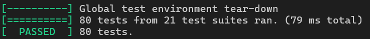

# Лабораторная работа 6. Парсер конфигурационных файлов OMFL
------------------------
Библиотека для парсинга конфигурационных файлов в формате OMFL (OneMoreFunnyLanguage) с поддержкой сложных структур данных.

## Особенности реализации
- Стандарт языка: C++17 с использованием STL
- Поддержка вложенных секций и массивов любой глубины
- Строгая типизация значений (int, float, bool, string, array, section)
- Гибкая система обработки ошибок и валидации синтаксиса

## Основные функции и классы

**Класс Value:**
- Методы проверки типа: `IsInt()`, `IsString()`, `IsArray()` и др.
- Методы преобразования: `AsInt()`, `AsString()`, `AsArray()` и др.
- Статические методы создания значений: `CreateInt()`, `CreateString()` и др.

**Класс Section:**
- Метод `Get()` для доступа к значениям по ключу
- Метод `Has()` для проверки существования ключа
- Внутреннее хранилище значений `std::map<std::string, Value>`

**Класс Config:**
- Корневая секция `root_`
- Флаг валидности `valid`
- Методы доступа `Get()` и `Has()`

**Функция Parse:**
- Обработка многострочных конфигурационных файлов
- Поддержка комментариев (символ #)
- Парсинг вложенных структур через точку в именах секций

## Форматы данных
- Строки: `"text"` (в двойных кавычках)
- Числа: `123` (целые), `3.14` (вещественные)
- Булевы значения: `true`, `false`
- Массивы: `[1, "text", true]` (гетерогенные)
- Секции: `[section.subsection]`

## Обработка ошибок
- Проверка корректности синтаксиса файла
- Обработка дублирования ключей
- Проверка типов при доступе к значениям
- Исключения при попытке доступа к несуществующим ключам

## Ограничения
- Максимальная глубина вложенности секций: 256
- Максимальная длина строкового значения: 65535 символов
- Максимальное количество элементов в массиве: 65535
- Поддержка только UTF-8 в строковых значениях

## Результаты тестов
