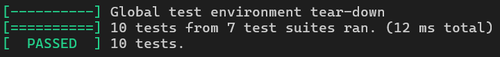

# Лабораторная работа №7. Парсер метаинформации в формате ID3v2.4 из mp3 - файлов

Программа на C++ для чтения и отображения тегов ID3v2 из MP3-файлов. Поддерживает фреймы текста, URL, комментариев и обрабатывает неизвестные фреймы.

## Особенности реализации

- Поддержка ID3v2.3 и ID3v2.4 тегов
- Чтение текстовых фреймов (TXXX)
- Чтение URL-фреймов (WXXX)
- Чтение фреймов комментариев (COMM)
- Обработка synchsafe integers
- Фабричный метод для создания объектов фреймов
- Расширяемая архитектура для добавления новых типов фреймов

## Основные функции и классы парсера

### Ключевые классы:
- `Frame` - базовый класс для всех типов фреймов
- `TextFrame` - обработка текстовых фреймов (начинаются с 'T')
- `UrlFrame` - обработка URL-фреймов (начинаются с 'W') 
- `CommentFrame` - обработка фреймов комментариев (COMM)
- `UnknownFrame` - обработка неизвестных типов фреймов

### Основные функции:
- `readSynchSafeInteger()` - чтение synchsafe integer из 4 байт
- `createFrame()` - фабричный метод для создания объектов фреймов
- `getFrameDescription()` - получение описания фрейма по его ID

## Использование


```bash
./mp3parser .../путь/file.mp3
```

## Формат вывода

Программа выводит информацию в следующем формате:
```
ID3v2.3.0 tag, size=12345
TIT2 (Название): Название
TPE1 (Исполнитель): Исполнитель
TALB (Альбом): Альбом
COMM [eng]: Some comment text
WXXX (URL): http://example.com
```

## Тестирование

- **Чтение синхросейф-интегеров**: проверка корректности декодирования чисел в формате SynchSafe.
- **Описание фреймов**: тесты для получения описаний фреймов по их ID, включая обработку неизвестных ID.
- **Вывод информации о фреймах**: проверка форматированного вывода для различных типов фреймов (`TextFrame`, `UrlFrame`, `CommentFrame`, `UnknownFrame`).
- **Фабрика фреймов**: тестирование создания объектов фреймов в зависимости от их ID.

### Результаты тестов:


## Ограничения

1. Поддерживаются только ID3v2 теги (версии 2.3 и 2.4)
2. Не поддерживаются:
   - Сжатые фреймы
   - Шифрованные фреймы
   - Фреймы группы (Group ID)
   - Фреймы с unsynchronisation
3. Максимальный размер тега ограничен размером uint32_t
4. Поддержка только базовых текстовых кодировок
5. Не реализована запись тегов, только чтение
