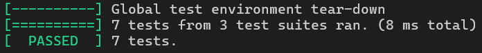

# Лабораторная работа №8. Бинарное дерево поиска и STL-контейнеры

Программа реализует три варианта бинарных деревьев поиска (BST) с разными стратегиями обхода (in-order, pre-order, post-order), используя шаблоны классов и итераторы для гибкости и совместимости со STL.

## Особенности реализации

- Реализованы три варианта бинарных деревьев поиска (BST) с разными стратегиями обхода: in-order, pre-order и post-order.
- Каждый вариант BST предоставляет итераторы для обхода элементов в соответствующем порядке.
- Поддерживаются стандартные операции: вставка, поиск, удаление (через `clear`), подсчет элементов.
- Итераторы соответствуют категории двунаправленных (bidirectional), что позволяет обходить дерево как вперед, так и назад.
- Используется аллокатор для управления памятью, что обеспечивает гибкость в распределении ресурсов.
- Реализована поддержка константных итераторов, а также реверсивных итераторов.

## Основные функции и классы

### Классы BST:
- `BST_InOrder<T, Compare, Allocator>`: BST с обходом in-order (левый поддерево -> корень -> правое поддерево).
- `BST_PreOrder<T, Compare, Allocator>`: BST с обходом pre-order (корень -> левое поддерево -> правое поддерево).
- `BST_PostOrder<T, Compare, Allocator>`: BST с обходом post-order (левое поддерево -> правое поддерево -> корень).

### Основные методы:
- `insert(const T& v)`: вставляет элемент в дерево. Возвращает пару (итератор, bool), где bool указывает, был ли элемент вставлен.
- `find(const T& v)`: возвращает итератор на элемент или `end()`, если элемент не найден.
- `count(const T& v)`: возвращает количество элементов с заданным значением (0 или 1).
- `clear()`: удаляет все элементы из дерева.
- `size()`: возвращает количество элементов в дереве.
- `empty()`: проверяет, пусто ли дерево.
- Итераторы: `begin()`, `end()`, `cbegin()`, `cend()`, `rbegin()`, `rend()`.

## Использование

Значения для вычисления указываются в массиве `values[]` в точке входа.

## Формат вывода

Пример вывода программы:
```
In-order: 1 2 3 5 7 8 9
Pre-order: 5 2 1 3 8 7 9
Post-order: 1 3 2 7 9 8 5
```

## Тестирование

- Проверка требований к типам (type traits).
- Базовые операции: вставка, поиск, подсчет элементов.
- Обход элементов в правильном порядке для каждого типа BST.
- Работа с пустым деревом.
- Проверка константных итераторов.

### Результаты тестов:


## Ограничения

- Удаление отдельных элементов не реализовано (только полная очистка через `clear()`).
- Поддержка только двунаправленных итераторов (нет случайного доступа).
- Для работы с пользовательскими типами требуется определить оператор сравнения или предоставить компаратор.
