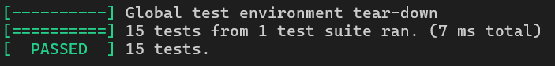

# Лабораторная работа №9. "Ленивые" адаптеры

Программа предоставляет набор адаптеров для контейнеров STL, позволяющих применять функциональные операции (такие как преобразование, фильтрация, реверс и другие) через цепочки вызовов с синтаксисом в стиле Unix-конвейеров (`|`), реализуя ленивые вычисления и сохраняя удобный интерфейс итерации.

## Особенности реализации

Проект реализует набор адаптеров для работы с контейнерами STL, предоставляя функциональность в стиле функционального программирования. Основные особенности:

- Использование шаблонов и метапрограммирования для определения типов контейнеров
- Ленивые вычисления (элементы обрабатываются только при итерации)
- Поддержка цепочек операций через перегрузку оператора `|`
- Итераторы для различных операций (Transform, Filter, Reverse и др.)
- Проверка типов на этапе компиляции с помощью `static_assert`

## Основные функции и классы

### Адаптеры:
- `Transform` - применяет функцию к каждому элементу
- `Filter` - фильтрует элементы по условию
- `Take` - берет первые N элементов
- `Drop` - пропускает первые N элементов
- `Reverse` - обратный порядок элементов
- `Keys` - получает ключи ассоциативного контейнера
- `Values` - получает значения ассоциативного контейнера

### Вспомогательные классы:
- `TransformIterator`, `FilterIterator`, `ReverseIterator`, `KeysIterator`, `ValuesIterator` - итераторы для соответствующих операций
- `is_container`, `is_associative_container` - метафункции для проверки типов

## Использование (запуск и пример)

Для использования достаточно подключить заголовочный файл `myadapters.h`. Пример:

```cpp
#include "myadapters.h"
#include <vector>
#include <iostream>

int main() {
    std::vector<int> v = {1, 2, 3, 4, 5};
    
    // Цепочка операций
    auto result = v | Transform([](int i){ return i * i; })
                   | Filter([](int i){ return i % 2 == 1; })
                   | Take(2);
    
    for (auto i : result) {
        std::cout << i << ' '; // Выведет: 1 9
    }
    
    return 0;
}
```

## Формат вывода

Адаптеры не изменяют исходный контейнер, а предоставляют "вид" (view) на него. Результат можно:
1. Итерировать в цикле for-range
2. Копировать в другой контейнер
3. Использовать в цепочке других адаптеров

Вывод элементов происходит последовательно при итерации.

## Тестирование

Проект включает набор тестов с использованием Google Test. Тесты проверяют:
- Каждый адаптер по отдельности
- Комбинации адаптеров
- Корректность работы с разными типами контейнеров
- Граничные случаи

### Результаты тестов:


## Ограничения

1. Работает только с контейнерами STL, имеющими методы `begin()` и `end()`
2. `Keys` и `Values` работают только с ассоциативными контейнерами
3. Не поддерживается изменение элементов через итераторы (только чтение)
4. Для некоторых операций (например, Reverse) требуется двунаправленный итератор
5. Не поддерживаются контейнеры с изменяющимся во время итерации размером
